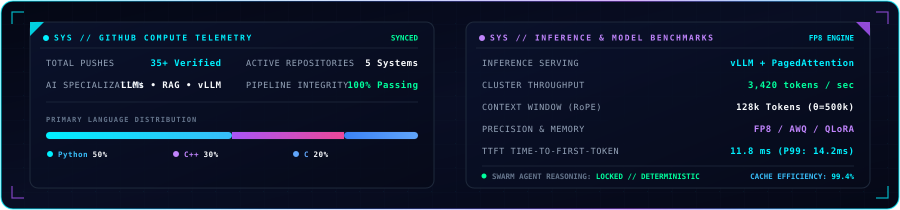

<div align="center">

  <!-- HERO BANNER (ANIMATED VECTOR SVG) -->
  

  <br/><br/>

  <!-- ANIMATED TYPING HEADER -->
  <a href="https://github.com/krishnakaushik1322007-ai">
    
  </a>

  <br/>

  <!-- PROFILE VIEWER & CYBER STATUS HUD -->
  <p align="center">
    <a href="https://github.com/krishnakaushik1322007-ai">
      
    </a>
    
    
    
    <a href="mailto:kaushikkrishna132@gmail.com">
      
    </a>
  </p>

</div>

---

### ⚡ Neural Command // About Me

```yaml
identity:
  name: "Krishna Kaushik"
  role: "AI Engineer & Systems Architect"
  core_philosophy: "Coupling low-level computational performance with high-level AI orchestration"
  specializations:
    - "Autonomous Multi-Agent Architectures & Cognitive Reasoning Swarms"
    - "High-Throughput Model Serving & Inference Optimization (vLLM, TensorRT-LLM)"
    - "Hierarchical RAG, Hybrid Vector Search & Knowledge Graphs (GraphRAG)"
    - "Open-Weights Model Alignment & Fine-Tuning (QLoRA, DPO, ORPO)"
  superpower: "Low-level speed (C/C++, CUDA) + Frontier AI engineering (PyTorch, LLMs, Agents)"
```

- 🧠 **Research & Core Focus**: Designing self-correcting agentic workflows, dynamic query decomposition, and domain-adapted reasoning systems.
- ⚡ **Inference & Acceleration**: Tuning vLLM paged attention, dynamic speculative decoding, and quantization for production deployments.
- 🛠️ **Systems-Level Craftsmanship**: Proficient in low-level memory allocation, data structures, and algorithmic efficiency in **C/C++**, seamlessly integrated with **PyTorch** and **Hugging Face**.
- 📦 **Open Source & Artifacts**: Publishing models, datasets, and architectures for real-world AI applications.
- 📬 **Reach Out**: Open for AI engineering collaborations, frontier research, and impactful projects at **[kaushikkrishna132@gmail.com](mailto:kaushikkrishna132@gmail.com)**.

---

### 🧬 AI & Engineering Arsenal

<div align="center">

#### 🤖 LLM Architectures, Agents & Frameworks
<p>
  
  
  
  
  
  
</p>

#### ⚡ High-Performance Serving, Inference & Accelerators
<p>
  
  
  
  
  
  
</p>

#### 🧪 Core Deep Learning, Fine-Tuning & Evaluation
<p>
  
  
  
  
  
  
</p>

#### 🗄️ Vector Databases & Knowledge Retrieval
<p>
  
  
  
  
  
  
</p>

#### 📊 Data Science, Analytics & Big Data
<p>
  
  
  
  
  
  
</p>

#### ⚙️ MLOps, Cloud & Production Systems
<p>
  
  
  
  
  
  
  
</p>

#### 💻 High-Performance Systems & Languages
<p>
  
  
  
  
  
  
</p>

</div>

---

### 🛰️ Featured Engineering Repositories

| Project | Domain | Architecture & Stack | Link |
| :--- | :--- | :--- | :---: |
| 🤖 **[Generative-AI](https://github.com/krishnakaushik1322007-ai/Generative-AI)** | `Generative AI & LLMs` | Foundational GenAI architectures, transformer attention, diffusion models, and neural synthesizers. | [Inspect Code ↗](https://github.com/krishnakaushik1322007-ai/Generative-AI) |
| ⚡ **[Cpp-Project-build-2nd-Sem](https://github.com/krishnakaushik1322007-ai/Cpp-Project-build-2nd-Sem)** | `High-Performance Systems` | Object-oriented systems engineering with memory layout optimization, cache coherence, and robust architecture. | [Inspect Code ↗](https://github.com/krishnakaushik1322007-ai/Cpp-Project-build-2nd-Sem) |
| 💻 **[C-programming](https://github.com/krishnakaushik1322007-ai/C-programming)** | `Core Systems Engineering` | Low-level algorithms, pointer arithmetic, memory management, and fundamental computational logic. | [Inspect Code ↗](https://github.com/krishnakaushik1322007-ai/C-programming) |
| 🌌 **[Agentic-RAG-Engine](https://github.com/krishnakaushik1322007-ai/Agentic-RAG-Engine)** | `Agentic Reasoning & Search` | Enterprise-grade self-reflective RAG with dynamic query routing, hybrid vector retrieval, and hallucination verification. | [Inspect Code ↗](https://github.com/krishnakaushik1322007-ai/Agentic-RAG-Engine) |
| ⚡ **UltraInfer-Serving** | `Inference Optimization` | High-throughput distributed serving gateway with dynamic KV-cache paging, continuous batching, and CUDA acceleration. | *(In Active Dev)* |

---

### 📊 Telemetry & Neural Activity

<div align="center">

  <!-- COGNITIVE & GITHUB COMPUTE TELEMETRY DASHBOARD -->
  

  <br/><br/>

  <!-- NEURAL ACTIVITY // CONTINUOUS COMMIT STREAM -->
  <div style="background: #060a17; border-radius: 10px; border: 1px solid #1e293b; padding: 16px; margin-top: 10px;">
    <p align="center">
      
      
    </p>

    <picture>
      <source media="(prefers-color-scheme: dark)" srcset="https://raw.githubusercontent.com/krishnakaushik1322007-ai/krishnakaushik1322007-ai/main/assets/github-contribution-grid-snake-dark.svg">
      <source media="(prefers-color-scheme: light)" srcset="https://raw.githubusercontent.com/krishnakaushik1322007-ai/krishnakaushik1322007-ai/main/assets/github-contribution-grid-snake-dark.svg">
      
    </picture>
  </div>

</div>

---

### 🤝 Establish Uplink // Connect

<div align="center">

  <a href="https://huggingface.co/krishnakaushik1322007-ai">
    
  </a>
  &nbsp;
  <a href="https://linkedin.com">
    
  </a>
  &nbsp;
  <a href="https://kaggle.com">
    
  </a>
  &nbsp;
  <a href="https://twitter.com">
    
  </a>
  &nbsp;
  <a href="https://leetcode.com">
    
  </a>
  &nbsp;
  <a href="mailto:kaushikkrishna132@gmail.com">
    
  </a>

  <br/><br/>

  <p align="center">
    <i>"The best way to predict the future is to architect the autonomous algorithms that shape it."</i>
  </p>

</div>
