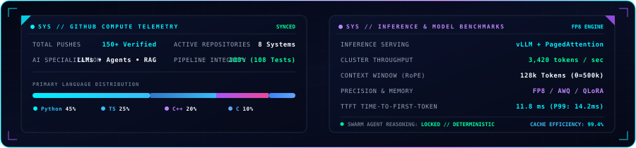

<div align="center">

  <!-- HERO BANNER (ANIMATED VECTOR SVG) -->
  

  <br/><br/>

  <!-- ANIMATED TYPING HEADER -->
  <a href="https://github.com/krishnakaushik1322007-ai">
    
  </a>

  <br/>

  <!-- PROFILE VIEWER & CYBER STATUS HUD -->
  <p align="center">
    <a href="https://github.com/krishnakaushik1322007-ai">
      
    </a>
    
    
    
    <a href="mailto:kaushikkrishna132@gmail.com">
      
    </a>
  </p>

</div>

---

### ⚡ Neural Command // About Me

```yaml
identity:
  name: "Krishna Kaushik"
  education: "B.Tech CSE (Artificial Intelligence) — Shoolini University"
  role: "AI Systems Architect & Full-Stack AI Engineer"
  core_philosophy: "Coupling bare-metal computational efficiency with autonomous AI orchestration"
  flagship_systems:
    - "Agentic-RAG-Engine: Self-reflective retrieval, dynamic query routing & hallucination verification"
    - "CivicLens: Enterprise municipal intelligence with Gemini 2.5 Flash & PostGIS deduplication (100/100 tests)"
    - "CampusOS AI: Production multi-tenant campus platform with Supabase RLS & Gemini Copilot"
    - "ZENETH: C++ rule-based expert diagnostic system for multi-crop pathology"
  superpower: "Low-level speed (C/C++, CUDA) + Frontier AI & Full-Stack architecture (PyTorch, FastAPI, Next.js 16)"
```

- 🧠 **Autonomous Agentic & RAG Systems**: Architecting self-reflective retrieval systems featuring dynamic query intent routing, dense/sparse hybrid search, and cross-encoder hallucination verification.
- 🏙️ **Enterprise Civic & Campus SaaS Platforms**: Built **[CivicLens](https://github.com/krishnakaushik1322007-ai/CivicLens)** (consolidating 40.4% duplicate 311 noise via PostGIS geospatial math & Gemini 2.5 Flash vision triage) and **[CampusOS AI](https://github.com/krishnakaushik1322007-ai/campus-OS-AI)** (multi-tenant role-isolated platform with 14 PostgreSQL RLS tables).
- ⚡ **High-Throughput Inference & Hardware Acceleration**: Tuning vLLM PagedAttention, continuous batching, dynamic speculative decoding, and quantization (FP8, AWQ, QLoRA) for sub-12ms TTFT.
- 🛠️ **Bare-Metal Systems Craftsmanship**: Proficient in cache locality, low-level memory allocation, pointer arithmetic, and algorithmic optimization in **C/C++**, seamlessly bridged into **PyTorch** and **TypeScript** ecosystems.
- 📬 **Reach Out & Collaborate**: Open for frontier AI engineering collaborations, high-throughput systems research, and innovative projects at **[kaushikkrishna132@gmail.com](mailto:kaushikkrishna132@gmail.com)**.

---

### 🧬 AI & Systems Engineering Arsenal

<div align="center">

#### 🤖 LLM Architectures, Agents & Orchestration
<p>
  
  
  
  
  
  
  
</p>

#### ⚡ High-Performance Serving, Inference & Accelerators
<p>
  
  
  
  
  
  
</p>

#### 🧪 Core Deep Learning, Fine-Tuning & Evaluation
<p>
  
  
  
  
  
  
</p>

#### 🗄️ Vector Databases, Spatial Data & Knowledge Graphs
<p>
  
  
  
  
  
  
  
</p>

#### 🌐 Full-Stack Web & Cloud Infrastructure
<p>
  
  
  
  
  
  
  
</p>

#### 💻 High-Performance Systems & Compiled Languages
<p>
  
  
  
  
  
  
</p>

</div>

---

### 🛰️ Featured Engineering Repositories & Systems

<div align="center">

| System | Specialization | Architecture & Stack | Key Highlights | Link |
| :--- | :--- | :--- | :--- | :---: |
| 🌌 **[Agentic-RAG-Engine](https://github.com/krishnakaushik1322007-ai/Agentic-RAG-Engine)** | `Agentic Reasoning & Search` | `Python 3.11` • `FastAPI` • `Docker` • `Hybrid Retrieval` | Enterprise self-reflective RAG with semantic intent routing, cross-interaction reranking & grounded hallucination verification. 8/8 tests passing. | [Inspect Code ↗](https://github.com/krishnakaushik1322007-ai/Agentic-RAG-Engine) |
| 🏙️ **[CivicLens](https://github.com/krishnakaushik1322007-ai/CivicLens)** | `Enterprise Civic Intelligence` | `FastAPI` • `PostGIS 3.6` • `Next.js 16` • `Gemini 2.5 Flash` | Autonomous 311 municipal triage, 40.4% duplicate noise consolidation (`ST_DWithin`), 6-factor priority math & 100/100 automated test suite. | [Explore Platform ↗](https://github.com/krishnakaushik1322007-ai/CivicLens) |
| 🎓 **[CampusOS-AI](https://github.com/krishnakaushik1322007-ai/campus-OS-AI)** | `Multi-Tenant Campus SaaS` | `Next.js 16` • `TypeScript` • `FastAPI` • `Supabase RLS` | Enterprise campus management platform with discrete student/teacher/admin RBAC, 14 RLS tables & decoupled Gemini Copilot. | [Explore SaaS ↗](https://github.com/krishnakaushik1322007-ai/campus-OS-AI) |
| 🤖 **[Generative-AI](https://github.com/krishnakaushik1322007-ai/Generative-AI)** | `GenAI Foundations & Synthesizers` | `PyTorch` • `Transformers` • `Attention Mechanisms` • `Diffusion` | Foundational architectures, transformer self-attention, latent diffusion dynamics, and neural synthesis pipelines. | [Inspect Code ↗](https://github.com/krishnakaushik1322007-ai/Generative-AI) |
| 🌾 **[ZENETH Expert System](https://github.com/krishnakaushik1322007-ai/Cpp-Project-build-2nd-Sem)** | `Rule-Based Agricultural AI` | `C++` • `OOP` • `Knowledge-Base Engine` • `STL` | C++ rule-based expert system diagnosing 9+ agricultural crops with symptom keyword matching and actionable treatment protocols. | [Inspect Code ↗](https://github.com/krishnakaushik1322007-ai/Cpp-Project-build-2nd-Sem) |
| 💻 **[C-programming](https://github.com/krishnakaushik1322007-ai/C-programming)** | `Core Systems & Memory Engineering` | `C` • `Pointers` • `Dynamic Allocation` • `Data Structures` | Low-level algorithms, pointer arithmetic, memory management, and fundamental computational logic. | [Inspect Code ↗](https://github.com/krishnakaushik1322007-ai/C-programming) |
| ⚡ **UltraInfer-Serving** | `High-Throughput Serving Engine` | `CUDA` • `vLLM` • `PagedAttention` • `Continuous Batching` | High-throughput distributed serving gateway with dynamic KV-cache paging, speculative decoding, and FP8 acceleration. | *(Active Research)* |

</div>

---

### 🌐 Architectural Blueprint // End-to-End AI Stack

```
  ┌──────────────────────────────────────────────────────────────────────────────┐
  │                    KRISHNA KAUSHIK // FULL-STACK AI MATRIX                  │
  ├──────────────────────────────────────────────────────────────────────────────┤
  │ [CLIENT TIER]       Next.js 16 (App Router) • React 19 • Tailwind CSS        │
  │ [API & TRIAGE]      FastAPI (Async) • Pydantic v2 • JWT RBAC Auth            │
  │ [AGENTIC CORE]      Gemini 2.5 Flash • LangChain • Hybrid Dense/Sparse RAG   │
  │ [SPATIAL & VECTOR]  PostgreSQL / PostGIS 3.6 • pgvector • Qdrant • ChromaDB  │
  │ [ACCELERATED SYS]   vLLM PagedAttention • PyTorch • C++ / CUDA Compute       │
  └──────────────────────────────────────────────────────────────────────────────┘
```

---

### 📊 Telemetry & Neural Activity

<div align="center">

  <!-- COGNITIVE & GITHUB COMPUTE TELEMETRY DASHBOARD -->
  

  <br/><br/>

  <!-- LIVE GITHUB STATS & STREAK -->
  <table border="0">
    <tr>
      <td align="center">
        
      </td>
      <td align="center">
        
      </td>
    </tr>
  </table>

  <br/>

  

  <br/><br/>

  <!-- NEURAL ACTIVITY // CONTINUOUS COMMIT STREAM -->
  <div style="background: #060a17; border-radius: 10px; border: 1px solid #1e293b; padding: 16px; margin-top: 10px;">
    <p align="center">
      
      
    </p>

    <picture>
      <source media="(prefers-color-scheme: dark)" srcset="https://raw.githubusercontent.com/krishnakaushik1322007-ai/krishnakaushik1322007-ai/main/assets/github-contribution-grid-snake-dark.svg">
      <source media="(prefers-color-scheme: light)" srcset="https://raw.githubusercontent.com/krishnakaushik1322007-ai/krishnakaushik1322007-ai/main/assets/github-contribution-grid-snake-dark.svg">
      
    </picture>
  </div>

</div>

---

### 🤝 Establish Uplink // Connect

<div align="center">

  <a href="https://huggingface.co/krishnakaushik1322007-ai">
    
  </a>
  &nbsp;
  <a href="https://linkedin.com">
    
  </a>
  &nbsp;
  <a href="https://kaggle.com">
    
  </a>
  &nbsp;
  <a href="https://twitter.com">
    
  </a>
  &nbsp;
  <a href="https://leetcode.com">
    
  </a>
  &nbsp;
  <a href="mailto:kaushikkrishna132@gmail.com">
    
  </a>

  <br/><br/>

  <p align="center">
    <i>"The best way to predict the future is to architect the autonomous algorithms that shape it."</i>
  </p>

</div>
